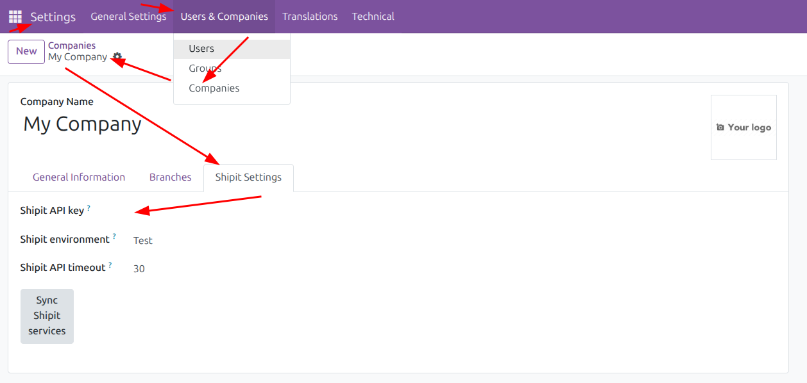
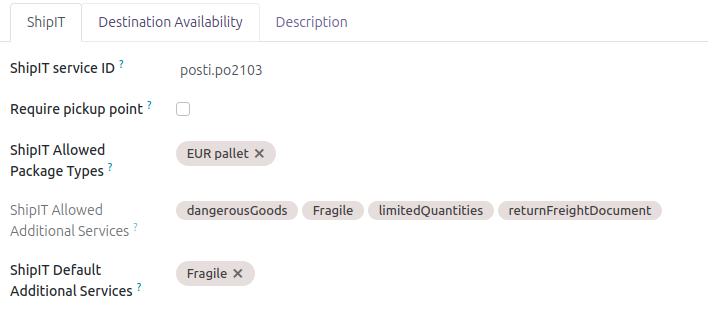
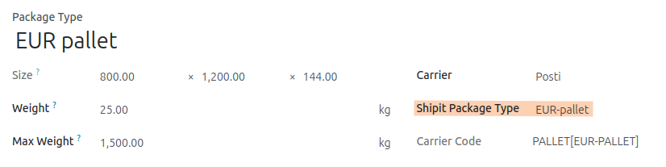

## Shipit configuration

1. After installing, go to `Settings -> User and companies -> Companies`
2. Go to the company you want to configure ShipIT integration for
2. Go to Shipit Settings tab, fill in your `API key` and save
3. Click Sync `Shipit services`

   

## Shipping methods

This will fetch the available services and create them in `Shipping methods`.
You can go to `Inventory > Configuration > Delivery > Shipping Methods` and see what's available and configure them further.

`Shipit Allowed Additional Services` are updated automatically when you sync Shipit services
`Shipit Allowed Package Types` need to be applied manually at the moment
`Shipit Default Additional Services` can be set to always suggest certain service on new deliveries using this shipping method

   

## Package types

If you use packaging, you can configure different package types to use.
Go to `Inventory > Configuration > Package Types`

You can create carrier-spesific package types here.
Regarding Shipit, the important part is `Shipit Package Type`.
Available package types are listed there, and you should pick one.

   

After that you can use that package type with the carrier.
You can also limit the available package types in `Shipping methods` (see previous step).