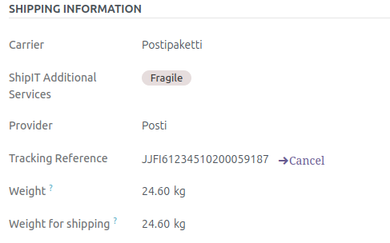
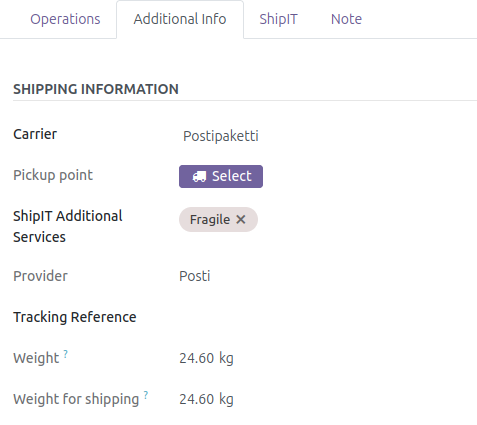
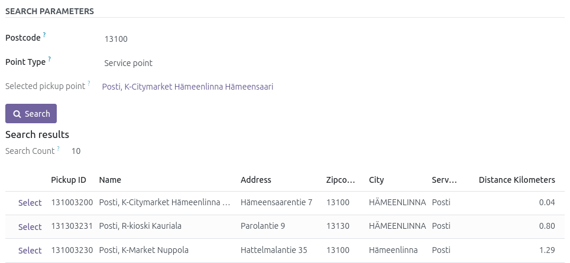

## Basic usage

1. **Select** any Shipit **shipment method** on Sale order (or Delivery order)
2. **Confirm** the **Sale order**
3. **Confirm** the **Delivery order**

You will get a `Tracking reference` and a PDF label from Shipit.
**Done!**

Clicking the `Tracking`-button will take you to the tracking link.
In `Additional info`-tab, you will have the basic shipment info.

   

## Advanced usage

On an unconfirmed `Delivery order`, you can select more additional services and a `Pickup point` (for some shipment methods)

   

If you click **Select** next to `Pickup point`, a popup will open.
Select your post code, services and pickup point type and click `Search`.

After that you can just select and use the pickup point.

   

## Packing

If no packing is used, the package type will default to a generic `Package`. 
You can, however, use the packaging functionality that Odoo provides. 

If you pack the products before confirming the Delivery order, the shipment is sent to Shipit as a multi-package delivery. Each package having it's own dimensions and weight.